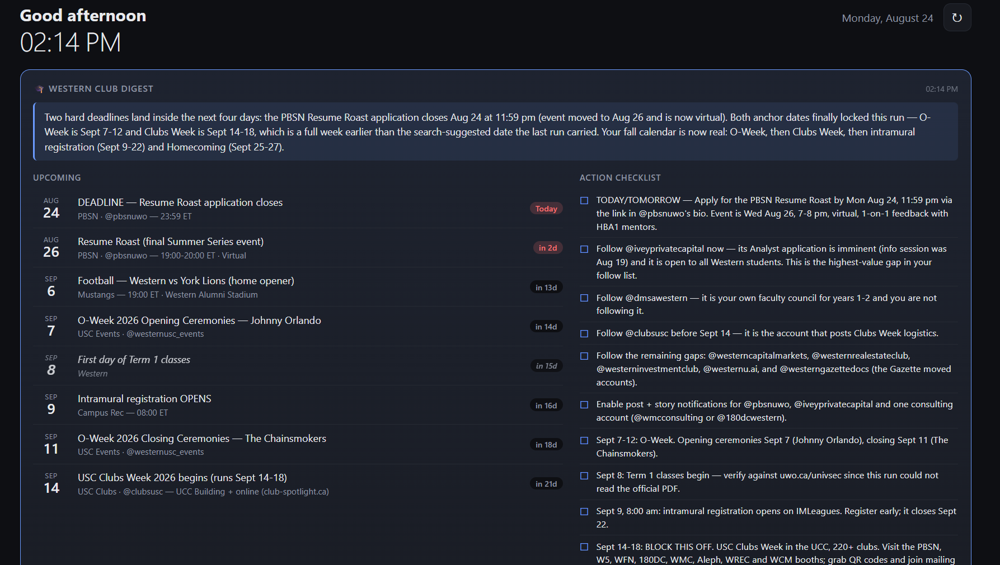

# Dashboard + Event Compiler

Two halves of one personal information system, running locally on a Windows
laptop.

**Event Compiler** sweeps a fixed registry of Instagram club accounts and
official university web sources every other day, extracts dated events and
deadlines, and writes them to a structured JSON file — along with a diff
against the previous run.

**Dashboard** is a local web app that reads that JSON alongside live weather,
Google Calendar, Gmail, RSS headlines and stock quotes, and renders the whole
thing at `http://localhost:3000`.

Neither half needs the other to run. Together, the compiler is the writer and
the dashboard is the reader, connected by one file on disk.



*The dashboard at `http://localhost:3000`. The Western Club Digest card at the top is
rendered straight from the event compiler's JSON output; the weather, agenda, email,
news and markets cards follow below it.*

## How the two halves connect

```
  ┌─────────────────────────┐
  │     Event Compiler      │   Windows scheduled task, every 2 days
  │  (Claude Code + skill)  │
  └───────────┬─────────────┘
              │  Lane A: signed-in Chrome → Instagram grids (read-only)
              │  Lane B: public web — events calendars, USC, Gazette, Careers
              ▼
  western_club_findings.json      ← events, deadlines, diff vs. last run
              │
              ▼
  ┌─────────────────────────┐
  │       Dashboard         │   Node + Express, 127.0.0.1 only
  │   GET /api/western      │   + weather, calendar, gmail, news, markets
  └───────────┬─────────────┘
              ▼
        http://localhost:3000
```

The dashboard's `config.json` has a `westernFindingsPath` pointing at the
compiler's output. It ships set to `../event-compiler/western_club_findings.json`,
so a plain clone wires itself up. The file is re-read on every refresh — no
restart needed when the compiler writes a new one.

## Getting started

Each half has its own setup guide:

| | What it is | Setup |
| --- | --- | --- |
| [`dashboard/`](dashboard/) | Node + Express web dashboard | [dashboard/README.md](dashboard/README.md) |
| [`event-compiler/`](event-compiler/) | Claude Code skill + scheduled runner | [event-compiler/README.md](event-compiler/README.md) |

Quickest path to something on screen:

```bash
cd dashboard
npm install
npm start
# open http://localhost:3000
```

Weather, headlines, dev feeds and markets work immediately with no API keys.
Calendar and email need a one-time Google OAuth setup; the Western Club Digest
card needs the event compiler to have written a findings file at least once —
or you can point `westernFindingsPath` at
`../event-compiler/sample-findings.json` to see the card populated right away.

## Repository layout

```
dashboard/
  server.js               Express API: weather, calendar, gmail, news, markets, western
  public/                 Single-page frontend (no build step, no framework)
  scripts/dashboard.ps1   install / start / stop / status / log for the background service
  scripts/launch-hidden.vbs  Hidden-window launcher with crash restart
  config.json             Feeds, tickers, email keyword groups, refresh intervals
  secrets.example.json    Template for Google OAuth credentials

event-compiler/
  skill/SKILL.md          The compiler itself — source registry, method, output schema
  run_igchecker.ps1       Scheduled-run wrapper around Claude Code
  setup_igchecker_task.ps1   Registers the Windows scheduled task
  sample-findings.json    Trimmed example of the output shape

docs/                     Screenshots
```

## What is deliberately not here

- **No credentials.** `secrets.json` and `token.json` are git-ignored. Google
  OAuth tokens live only on the machine that created them.
- **No live findings file.** `western_club_findings.json` is regenerated on
  every run, so it is git-ignored; `sample-findings.json` documents the shape.
- **No network exposure.** The dashboard binds to `127.0.0.1` and has no login,
  precisely because it hands over an inbox and a calendar to anyone who can
  open it.

## Requirements

- Windows 10/11 (the scheduling and service scripts are PowerShell + VBScript)
- Node.js 18+ for the dashboard
- [Claude Code](https://claude.com/claude-code) with the Chrome extension, for
  the event compiler
- A Google Cloud project, only if you want the calendar and email cards
